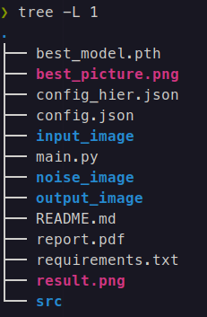

# 使用說明
## 安裝 Python 虛擬環境
```bash
pip -m venv .venv
source .venv/bin/activate
pip -r requirements.txt
```
## 如何執行
1. 先設定要執行的模型以及相關的超參數在 config.json 檔
2. 執行 main.py 讀取 config.json 裡面的超參數執行程式

假設已經在 python 虛擬環境裡
```bash
python3 main.py
```

## 專案檔案結構


* input_image/: 用於放入 ground truth 圖片的資料夾
* noise_image/: 用於產生雜訊圖片的資料夾
* output_image/: 用於生成去雜訊圖片的資料夾
* config.json: Standalone DIP 模型所使用到的超參數設定檔
* config_hier.json: Hierarchical DIP 模型所使用到的超參數設定檔 (若要使用該設定檔請將此檔名改成 config.json)
* result.png: 模型在訓練過程中生成圖片的 PSNR 對 epoch 的圖表
* best_picture.png: 模型在訓練過程中效果(PSNR)最好的圖片
